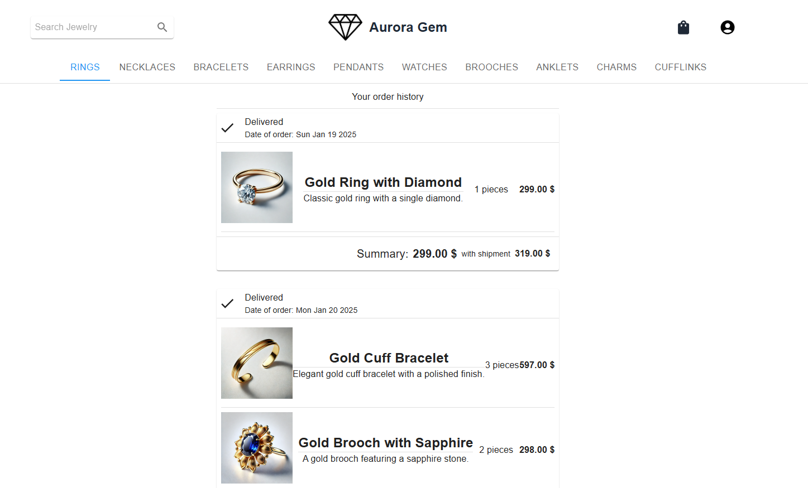
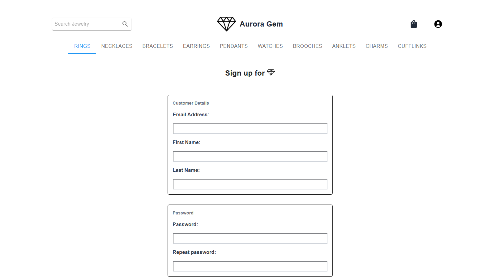

# Description

**Aurora Gem**, a full-stack jewelry store application built with **React.js** and **Express.js**, provides a seamless e-commerce experience, allowing users to search and filter products, add items to their cart, and place orders effortlessly. It features customer reviews and ratings, enhancing trust and engagement, while secure user authentication ensures a personalized shopping experience.

The application is designed with a **microservices architecture**, ensuring scalability and efficient service management. Additionally, it leverages **JWT** (JSON Web Token) authentication to provide a secure and seamless login experience. With a responsive design, smooth performance, and strong security measures, Aurora Gem delivers a modern and user-friendly platform for online jewelry sales.






## Main Technologies
The primary technologies used in this project are:
- **React**
- **Express**
- **TypeScript (TS)**
- **Material UI**
- **Tailwind**
- **Formik**
- **GSAP**

## Prerequisites
To run this project, ensure the following are installed:
- **Docker**
- **npm**


## Setup Instructions
1. Open a terminal and navigate to the project directory.
2. Execute the following commands:

```sh
# Navigate to the backend directory
cd /backend

# Run Docker, 
docker compose up -d

# Navigate to the main directory
cd ..

# Start the development server
npm run dev


```

## Contributors
- **Wojtek Pawlina** ([GitHub Profile](https://github.com/Wpawlina))
- **Seweryn Tasior** ([GitHub Profile](https://github.com/Sewery))


